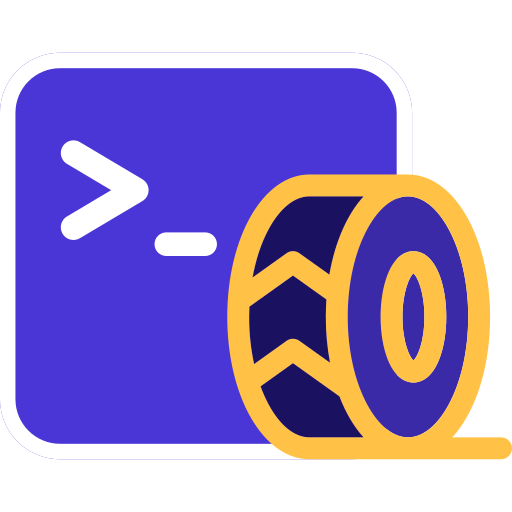
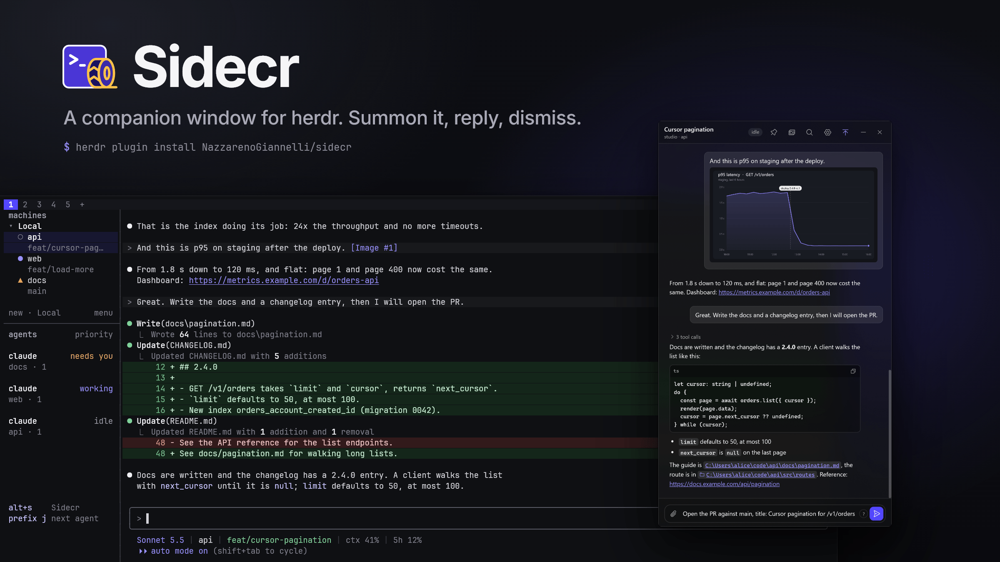

#  Sidecr

A companion window for the [herdr](https://github.com/herdrdev/herdr) terminal multiplexer: the Claude Code conversation of the focused pane, with attachments, previews and clickable links.



## What it is

Sidecr is a small window you summon with a key on top of herdr. It shows the conversation of the Claude Code pane you are in, so you can look at the images it mentions, open the links, files and folders it names, and send a message with attachments (pasted, dragged or picked with the paperclip). Then you dismiss it with Esc and you are back in the terminal. The session never moves: Sidecr reads the pane's transcript and types your message into the same pane through herdr.

## Features

- Conversation view: the latest exchanges of the pane's session, Markdown answers (code blocks with a copy button, lists, tables, links) and tool calls folded into an expandable list.
- Attachments by paste, drag and drop, or the paperclip; Claude Code receives them as `@path` mentions.
- Images open in a lightbox, and fullscreen with Shift+click or `F`.
- Clickable links, files and folders. A file type that is not opened from a click (scripts, executables, archives) is shown in its folder instead; Shift+click does that for any file ("Show in folder").
- History in blocks: scroll up (or press "Load earlier") to bring in older exchanges, back to the start of the session.
- A Media & links panel with every image and link the session shared.
- Follows the pane selected in herdr, or stays pinned to one pane; a switcher (`Ctrl+K`) moves between Claude panes by name.
- Settings: what the window shows, text size, the send key, how it follows herdr and, in the optional native shell on Windows, a translucent acrylic background, the accent colour and always on top.
- Keyboard shortcuts for everything, with an in-app cheat sheet (`Ctrl+/`).
- A silent system notification when Claude finishes or needs you while the window is in the background.

## Requirements

- [herdr](https://github.com/herdrdev/herdr) 0.9.0 or newer.
- [Bun](https://bun.sh) 1.3 or newer, on the PATH that the herdr server sees.
- Panes running [Claude Code](https://docs.claude.com/en/docs/claude-code). Other agents are not supported.
- Windows 11 (Windows 10 has not been tested), or Linux with a graphical session.
- Microsoft Edge, Google Chrome or Chromium. On Windows, Edge is already there. Only these are looked for, at fixed places: on Windows the standard install folders of Edge and Chrome; on Linux the commands `microsoft-edge-stable`, `microsoft-edge`, `google-chrome-stable`, `google-chrome`, `chromium` and `chromium-browser` on `PATH`. Other browsers (Brave, Vivaldi, Opera) and a browser installed only as a Snap or Flatpak without one of those commands are not found, and the open command exits with code 3. There is no setting to name another browser.
- Rust only if you want to build the optional native shell on Windows.

## Install

```bash
herdr plugin install NazzarenoGiannelli/sidecr
```

herdr fetches the repository and shows the two build steps from the plugin manifest; after you confirm, it runs them in the plugin directory:

- `bun install` installs the development dependencies (TypeScript and Bun's type definitions). Sidecr has no runtime dependencies.
- `bun run build:ui` bundles the window's code into `dist/`.

To install a given release, add `--ref`, for example `herdr plugin install NazzarenoGiannelli/sidecr --ref v0.1.0`.

Then bind a key in herdr's `config.toml`:

```toml
[[keys.command]]
key = "alt+s"
type = "plugin_action"
command = "nazz.sidecr.open"
description = "Sidecr (Alt+S)"
```

and reload the configuration:

```bash
herdr config check
herdr server reload-config
```

Any chord your terminal passes on to herdr can open and close Sidecr from the terminal. `Alt+S` is the suggestion because the window knows it too: the window does not know your binding, and inside it only `Alt+S`, `Ctrl+Shift+J` and Esc close it. With another chord, pressing it again closes the window only while the herdr terminal has focus.

**From a local checkout.** `herdr plugin link <path>` registers a clone, but it does not run the build steps (checked on herdr 0.9.1). Build once yourself in the clone, and again after every pull:

```bash
git clone https://github.com/NazzarenoGiannelli/sidecr.git
cd sidecr
bun install && bun run build:ui
herdr plugin link .
```

**`bun` must be on herdr's PATH.** The open action runs `bun src/open.ts` with the PATH of the herdr server process. If `herdr plugin log list` shows `No such file or directory`, the server was started with a bare PATH: link `bun` somewhere on it (for example `ln -s ~/.bun/bin/bun ~/.local/bin/bun`) and restart herdr from a login shell. On Windows it works when `bun` is on the user PATH.

**Remove.** `herdr plugin uninstall nazz.sidecr` for an installed plugin (or `herdr plugin unlink nazz.sidecr` for a linked checkout), delete the key block from `config.toml` and run `herdr server reload-config`. If you built the native shell, also delete `shell/src-tauri/target/` (several GB of build output) and the shell's WebView2 data in `%LOCALAPPDATA%\dev.nazz.sidecr`.

## Use

Press the key in a herdr pane running Claude Code: the window opens on that pane. Type, press Enter, and the message goes to the pane. To close it, press the key again in the terminal, or in the window press `Alt+S`, `Ctrl+Shift+J`, or Esc once nothing is open and the composer is empty (these work whatever key you bound). There is only ever one window.

The full list, the same as the in-app cheat sheet (`Ctrl+/`):

| Group | Keys | What it does |
|---|---|---|
| Window | `Alt+S` | Open or close Sidecr (in the terminal: the key you bound in herdr, Alt+S in the example) |
| Sessions | `Ctrl+K`, `Ctrl+Shift+K` | Switch session |
| Sessions | `Alt+↑` | Previous session in the list |
| Sessions | `Alt+↓` | Next session in the list |
| Sessions | `Alt+1…9` | Session 1 to 9 of the list |
| Sessions | `Ctrl+Shift+L` | Pin this session, or follow the pane selected in herdr again |
| Sessions | `Alt+.` | Go to the pane selected in herdr |
| Messages | `Enter` | Send (Ctrl+Enter instead when the settings say so) |
| Messages | `Shift+Enter` | New line (Enter as well when Ctrl+Enter sends) |
| Messages | `↑`, `↓` | Recall your earlier messages (empty composer) |
| Messages | `Ctrl+End` | Scroll to the bottom |
| Messages | `Ctrl+Shift+C` | Copy the last answer as Markdown |
| Messages | `Click` | Open a folder link in the file manager |
| Messages | `Shift+Click` | Show a file link in its folder |
| Images | `Click` | Open an image |
| Images | `Shift+Click` | Open an image fullscreen |
| Images | `F` | Fullscreen on or off (open image) |
| Images | `Ctrl+Shift+M` | Media & links of this session |
| Images | `←`, `→`, `1`, `2` | Images or Links tab (Media & links open) |
| Images | `←`, `→` | Previous or next image (fullscreen) (native shell only) |
| Window | `Alt+S`, `Ctrl+Shift+J` | Close Sidecr |
| Window | `Ctrl+Shift+T` | Toggle always on top (native shell only) |
| Window | `Esc` | Close the top layer; with nothing open and an empty composer, close Sidecr |
| Settings | `Ctrl+,` | Settings |
| Settings | `Ctrl+/`, `?` | Keyboard shortcuts |

Sending is refused while a menu is open in the terminal (a permission prompt, or a slash menu such as `/model`): answer it there first. A message longer than 30,000 characters is refused: attach it as a file. While Claude works, a row above the composer shows what it is doing, with a Stop button that sends one Esc to the pane.

[docs/architecture.md](docs/architecture.md) explains how following herdr, history, drafts and settings behave in detail.

## Native shell on Windows (optional)

By default Sidecr opens a Chromium app window (Edge or Chrome). On Windows you can build `sidecr-shell`, a small Tauri 2 program that shows the same page in a frameless, rounded, always-on-top window with a translucent background (Acrylic, Mica on Windows 11, or Blur), a configurable accent colour, and a fullscreen image viewer on its own window. It needs Rust, the Tauri CLI (`cargo install tauri-cli --version "^2"`) and the WebView2 runtime (already on Windows 11):

```bash
bun run build:shell
```

Once built, the open key uses it, and falls back to the Chromium window if it fails to start. Details, environment variables and how to test a shell build safely: [docs/native-shell.md](docs/native-shell.md).

## Linux notes

On Linux the Chromium app window is the supported path; the native shell is untested there.

- **Browser lookup.** The first of `microsoft-edge-stable`, `microsoft-edge`, `google-chrome-stable`, `google-chrome`, `chromium`, `chromium-browser` found on `PATH` is used.
- **Graphical session recovery.** A herdr server started over SSH has no `WAYLAND_DISPLAY` or `DISPLAY`. Sidecr then asks `systemctl --user show-environment` for the session variables; if there is still no display, the open command exits with code 5.
- **Hyprland and Omarchy.** The window's app id is `chrome-localhost__-Sidecr`. To make it float, on Omarchy add to `~/.config/hypr/hyprland.lua`:

  ```lua
  o.window("chrome-localhost__-Sidecr", { float = true, pin = true, center = true })
  ```

  In the classic Hyprland syntax: `windowrule = float, class:^(chrome-localhost__-Sidecr)$`.

More in [docs/linux.md](docs/linux.md).

## macOS

Not supported yet, and the manifest does not list it. What is missing: Option+S composes a character in macOS terminals, so a different default chord is needed; the browser lookup does not know where macOS keeps its applications; the native shell has no vibrancy (the macOS translucency); and path checks compare case-sensitively, while macOS file systems usually ignore case. Contributions and testers are welcome.

## Safety and privacy

- **What it reads.** The Claude Code transcript of the focused pane (`~/.claude/projects/<project>/<session>.jsonl`), the pane's screen text through herdr (to see a menu or the spinner), herdr's list of panes and workspaces, and image files the conversation mentions, to preview them.
- **What it serves.** A local server on `127.0.0.1` only, with a random token created at every server start (kept in an HttpOnly cookie), a Host header allow-list and a refusal of cross-site requests. It makes no outbound network requests and has no telemetry.
- **What it can do.** Type text and `@path` attachment mentions into the pane shown, send one Esc to stop Claude, and open links (`http` and `https` only, in your browser), files and folders that the conversation mentioned.
- **What it never opens.** Scripts and executables (`exe`, `bat`, `ps1`, `sh`, `msi`, `js` and the like): they are only shown in their folder, never run. Only a short list of document types opens from a click. Three of them can run script: `.html` and `.htm` open in your browser, which runs the page as a double click would, and `.svg` opens in its default app, often the browser too.

The full model, with every check the server makes: [docs/privacy-and-safety.md](docs/privacy-and-safety.md).

## Limits

- **Local panes only.** herdr runs a plugin action on the machine that hosts the pane, and the transcript lives there too, so panes of remote machines (a saved SSH machine in herdr's sidebar) are not supported: Sidecr says so and keeps the last local conversation.
- **Claude Code's transcript format is not a public API.** Sidecr reads the JSONL files Claude Code writes; a change in that format can break the view until Sidecr is updated.
- **Attachments need a folder path without spaces.** Claude Code reads an `@path` mention only up to the first space, so Sidecr refuses to send an attachment when the folder it saves them in has a space in its path (on Windows, a user profile such as `C:\Users\Jane Doe`). Set `SIDECR_ATTACHMENTS_DIR` to a folder without spaces, used only for this (for example `C:\sidecr-attachments`), in the environment herdr starts from. Text messages are not affected.
- **Following herdr polls.** The server asks herdr for the focused pane every 0.7 seconds while a window is open (backing off to 5 seconds when herdr does not answer).
- One pane per window, no search through the history yet, at most 20,000 exchanges of history per session and the newest 5,000 images and 5,000 links in Media & links.
- A path with spaces is linked only inside a code span, quotes, or alone on a line of a fenced block; otherwise only up to its first space.
- **Not verified yet:** `herdr plugin install` from this repository (until it is public, only `herdr plugin link` was tested); Windows 10 (only Windows 11 was tested, for the Chromium window and the native shell); the native shell on Linux; Edge and Chrome on Linux (Chromium was tested); macOS in any form. The native shell restores the window position correctly only when all monitors use the same display scale.

## Troubleshooting

The open command writes one line to herdr's plugin log (`herdr plugin log list`) and exits with a code; the server logs to `server.log` in the plugin's state directory.

| What you see | Why, and what to do |
|---|---|
| Nothing happens on the key | Check `herdr config check`, then `herdr server reload-config`. In the plugin log: `No such file or directory` means `bun` is not on herdr's PATH (see Install); exit code 2 means no pane was in focus; exit 4 means the UI is not built (run `bun run build:ui` in the plugin directory). After a failed launch the server counts the window as starting for 6 seconds, so a press in that time does nothing: wait and press again. |
| Exit code 3 | Nothing to launch: no native shell and no supported browser was found. Install Edge, Chrome or Chromium (Brave and other browsers are not looked for; see Requirements). |
| Exit code 5 (Linux) | No graphical session: the herdr server has no `WAYLAND_DISPLAY` or `DISPLAY`, and `systemctl --user show-environment` did not provide one. Start herdr from your desktop session. See [docs/linux.md](docs/linux.md). |
| Exit code 6 (Linux) | The browser exited early with an error; the end of its stderr is in the message. Often a Wayland or X connection that failed, or a broken profile in the state directory (`profile/`, safe to delete). |
| The window is blank, or does not show, on a fresh browser profile | A GUI program started with a hidden show state opens its first window hidden. Sidecr never starts the browser, the shell or a file opener hidden, and a test guards it. If you see it, press the key again and open an issue with your OS and browser. |
| A text file "opens" but no editor appears | The same cause on the file opener (an editor started hidden). It should not happen; if it does, open an issue. |
| "This agent runs on another machine" | The pane belongs to a remote herdr machine; see Limits. |
| Sending is refused | A menu or prompt is open in the terminal: answer it there. Or the message is over 30,000 characters: attach it as a file. |
| "Attachments need a folder path without spaces" | The attachments folder (in the plugin's state directory, under your user profile) has a space in its path, which Claude Code cannot read in an `@path` mention. Set `SIDECR_ATTACHMENTS_DIR` to a folder without spaces, used only for this, restart herdr so its server sees the variable, and press the key again. |

## Development

```bash
bun install
bun test             # the whole suite; no herdr, display, browser or file manager needed
bun run typecheck
bun run build:ui     # bundles ui/ into dist/
bun run build:shell  # the native shell (Windows, needs Rust and the Tauri CLI)
bun run check:shell  # cargo check of the shell only
```

Tests never start a real window, browser, file manager or herdr command: those are injected. When you run Sidecr by hand while developing:

- A test build of the shell must not share the identifier of the shell you use, or it hands its address to your open window and exits. `bun run build:shell:test` builds with the identifier `dev.nazz.sidecr.test` into `shell/src-tauri/target-test/`.
- A stray `bun src/open.ts` from a herdr pane talks to your live server and can start your installed shell. Always set `HERDR_PLUGIN_STATE_DIR` to a throwaway folder, `SIDECR_PORT` to a throwaway port, and either `SIDECR_LAUNCHER=chromium` or `SIDECR_SHELL` pointing at the test build.

How the pieces fit: [docs/architecture.md](docs/architecture.md). Conventions for changes: [CONTRIBUTING.md](CONTRIBUTING.md). The original design and build plan are kept in [docs/design/](docs/design/).

## Credits and licence

Made by Nazzareno Giannelli. Icons are [Phosphor Icons](https://phosphoricons.com) (MIT); see [THIRD_PARTY_NOTICES.md](THIRD_PARTY_NOTICES.md). Sidecr is not affiliated with herdr or Anthropic.

MIT, see [LICENSE](LICENSE).
